<h2 align="center"> 30DaysOfCSS 🖌🚀 <h2>

## 📝 About 
30 days of CSS is a project that aims to improve coding skills by making mini daily projects using HTML5 and CSS.

 

## 🎯 Goal 
The 30 days of CSS challenge aims to improve learning about html and css (without frameworks), using animations and effects. A challenge created by [Milena Carecho](https://github.com/MilenaCarecho), [see here](https://github.com/MilenaCarecho/30diasDeCSS).

 

## 📣 Rules 
* Make one project a day;
* Share your progress on social media using the hashtags #30DaysOfCSS and #30diasDeCSS;
* The project must be completed by 11:59 pm.

 

## 🗒 Challenges 
* [Day 01 - Animation using search box](#id01)
* [Day 02 - Animated loader](#id02)
* [Day 03 - Layered social media icon](#id03)
* [Day 04 - Color changing checkbox](#id04)
* [Day 05 - Floating text](#id05)
* [Day 06 - Heart beating](#id06)
* [Day 07 - Shiny button](#id07)
* [Day 08 - Animated screen](#id08)
* [Day 09 - Animation with hover images](#id09)
* [Day 10 - Animated Checkbox Neon effect](#id10)
* [Day 11 - Pulsing effect](#id11)
* [Day 12 - Typewriter](#id12)
* [Day 13 - Text color change when entering another div](#id13)
* [Day 14 - Rotating card animation](#id14)
* [Day 15 - Shiny text](#id15)
* [Day 16 - Lightsaber](#id16)
* [Day 17 - Animated menu](#id17)
* [Day 18 - Smoky Text](#id18)
* [Day 19 - Background that changes color](#id19)
* [Day 20 - Fill effect when hovering](#id20)
* [Day 21 - Animated text background with stars](#id21)
* [Day 22 - Colorful animation](#id22)
* [Day 23 - Animation with text](#id23)
* [Day 24 - Image Slideshow](#id24)
* [Day 25 - Button with effect](#id25)
* [Day 26 - Animated circles](#id26)
* [Day 27 - Circles with effects](#id27)
* [Day 28 - Page Background Animation](#id28)
* [Day 29 - Effect with heart](#id29)
* [Day 30 - Fireworks](#id30)

 

## Day 01 - Animation using search box 
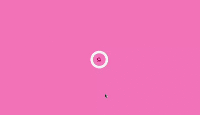

- [My Code](https://github.com/RaquelLima7/30DaysOfCSS/tree/main/Challenges/Day_01)
- [Post LinkedIn](https://www.linkedin.com/posts/raquellima7_30daysofcss-30diasdecss-frontend-activity-6794956990545235968-31Ht) 

 

## Day 02 - Animated loader 
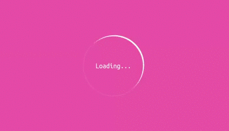

- [My Code](https://github.com/RaquelLima7/30DaysOfCSS/tree/main/Challenges/Day_02)
- [Post LinkedIn](https://www.linkedin.com/posts/raquellima7_30daysofcss-30diasdecss-frontend-activity-6795319631654531072-_PiO) 

 

## Day 03 - Layered social media icon 

- [My Code](https://github.com/RaquelLima7/30DaysOfCSS/tree/main/Challenges/Day_03)
- [Post LinkedIn](https://www.linkedin.com/posts/raquellima7_30daysofcss-30diasdecss-frontend-activity-6795670904497082368-x8Ye) 

 

## Day 04 - Color changing checkbox 
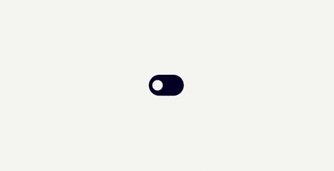

- [My Code](https://github.com/RaquelLima7/30DaysOfCSS/tree/main/Challenges/Day_04)
- [Post LinkedIn](https://www.linkedin.com/posts/raquellima7_30daysofcss-30diasdecss-frontend-activity-6796052162389573633-2p3x) 

 

## Day 05 - Floating text 
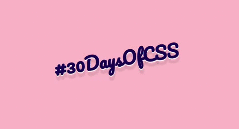

- [My Code](https://github.com/RaquelLima7/30DaysOfCSS/tree/main/Challenges/Day_05)
- [Post LinkedIn](https://www.linkedin.com/posts/raquellima7_30daysofcss-30diasdecss-frontend-activity-6796385653291569152-qRSx) 

 

## Day 06 - Heart beating 

- [My Code](https://github.com/RaquelLima7/30DaysOfCSS/tree/main/Challenges/Day_06)
- [Post LinkedIn](https://www.linkedin.com/posts/raquellima7_30daysofcss-30diasdecss-frontend-activity-6796781476336738304-JCCc) 

 

## Day 07 - Shiny button 
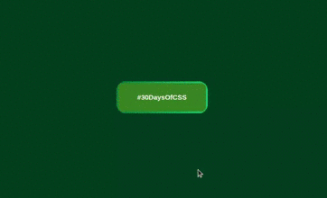

- [My Code](https://github.com/RaquelLima7/30DaysOfCSS/tree/main/Challenges/Day_07)
- [Post LinkedIn](https://www.linkedin.com/posts/raquellima7_30daysofcss-30diasdecss-frontend-activity-6797171324776185856-fF9c) 

 

## Day 08 - Animated screen 
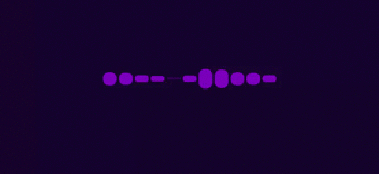

- [My Code](https://github.com/RaquelLima7/30DaysOfCSS/tree/main/Challenges/Day_08)
- [Post LinkedIn](https://www.linkedin.com/posts/raquellima7_30daysofcss-30diasdecss-frontend-activity-6797502442012512256-rpiM) 

 

## Day 09 - Animation with hover images 
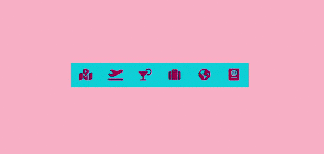

- [My Code](https://github.com/RaquelLima7/30DaysOfCSS/tree/main/Challenges/Day_09)
- [Post LinkedIn](https://www.linkedin.com/posts/raquellima7_30daysofcss-30diasdecss-frontend-activity-6797858467349622784-NtLV) 

 

## Day 10 - Animated Checkbox Neon effect 
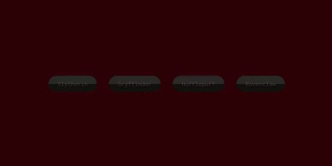

- [My Code](https://github.com/RaquelLima7/30DaysOfCSS/tree/main/Challenges/Day_10)
- [Post LinkedIn](https://www.linkedin.com/posts/raquellima7_30daysofcss-30diasdecss-frontend-activity-6798220475148382208-vQlE) 

 

## Day 11 - Pulsing effect 

- [My Code](https://github.com/RaquelLima7/30DaysOfCSS/tree/main/Challenges/Day_11)
- [Post LinkedIn](https://www.linkedin.com/posts/raquellima7_30daysofcss-30diasdecss-frontend-activity-6798654996767420416-oF4-) 

 

## Day 12 - Typewriter 

- [My Code](https://github.com/RaquelLima7/30DaysOfCSS/tree/main/Challenges/Day_12)
- [Post LinkedIn](https://www.linkedin.com/posts/raquellima7_30daysofcss-30diasdecss-frontend-activity-6798967575511388160-l6ys) 

 

## Day 13 - Text color change when entering another div 

- [My Code](https://github.com/RaquelLima7/30DaysOfCSS/tree/main/Challenges/Day_13)
- [Post LinkedIn](https://www.linkedin.com/posts/raquellima7_30daysofcss-30diasdecss-frontend-activity-6799319539822723072-XLkX) 

 

## Day 14 - Rotating card animation 
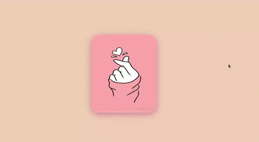

- [My Code](https://github.com/RaquelLima7/30DaysOfCSS/tree/main/Challenges/Day_14)
- [Post LinkedIn](https://www.linkedin.com/posts/raquellima7_30daysofcss-30diasdecss-frontend-activity-6799710257833672704-4EKR) 

 

## Day 15 - Shiny text 
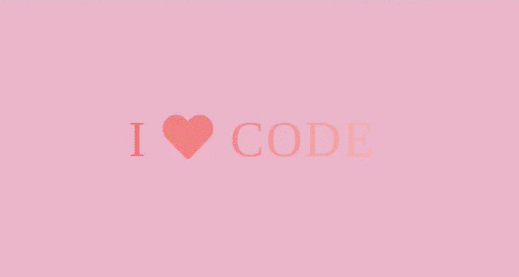

- [My Code](https://github.com/RaquelLima7/30DaysOfCSS/tree/main/Challenges/Day_15)
- [Post LinkedIn](https://www.linkedin.com/posts/raquellima7_30daysofcss-30diasdecss-frontend-activity-6800014639368323072-zJiY) 

 

## Day 16 - Lightsaber 

- [My Code](https://github.com/RaquelLima7/30DaysOfCSS/tree/main/Challenges/Day_16)
- [Post LinkedIn](https://www.linkedin.com/posts/raquellima7_30daysofcss-30diasdecss-frontend-activity-6800446779121840128-2Dnm) 

 

## Day 17 - Animated menu 
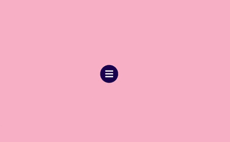

- [My Code](https://github.com/RaquelLima7/30DaysOfCSS/tree/main/Challenges/Day_17)
- [Post LinkedIn](https://www.linkedin.com/posts/raquellima7_30daysofcss-30diasdecss-frontend-activity-6800766044014198784-pyRI) 

 

## Day 18 - Smoky Text 
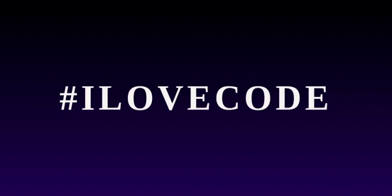

- [My Code](https://github.com/RaquelLima7/30DaysOfCSS/tree/main/Challenges/Day_18)
- [Post LinkedIn](https://www.linkedin.com/posts/raquellima7_30daysofcss-30diasdecss-frontend-activity-6801122745724805120-xpg5) 

 

## Day 19 - Background that changes color 
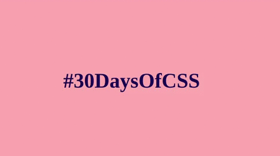

- [My Code](https://github.com/RaquelLima7/30DaysOfCSS/tree/main/Challenges/Day_19)
- [Post LinkedIn](https://www.linkedin.com/posts/raquellima7_30daysofcss-30diasdecss-frontend-activity-6801491770749321216-RZOR) 

 

## Day 20 - Fill effect when hovering 
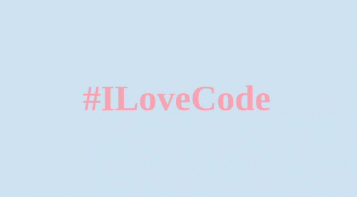

- [My Code](https://github.com/RaquelLima7/30DaysOfCSS/tree/main/Challenges/Day_20)
- [Post LinkedIn](https://www.linkedin.com/posts/raquellima7_30daysofcss-30diasdecss-frontend-activity-6801848473181327360-9M2d) 

 

## Day 21 - Animated text background with stars 
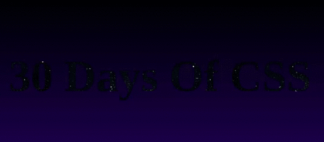

- [My Code](https://github.com/RaquelLima7/30DaysOfCSS/tree/main/Challenges/Day_21)
- [Post LinkedIn](https://www.linkedin.com/posts/raquellima7_30daysofcss-30diasdecss-frontend-activity-6802247092950614016-3Xta) 

 

## Day 22 - Colorful animation 

- [My Code](https://github.com/RaquelLima7/30DaysOfCSS/tree/main/Challenges/Day_22)
- [Post LinkedIn](https://www.linkedin.com/posts/raquellima7_30daysofcss-30diasdecss-frontend-activity-6802569834723889152-ttYb) 

 

## Day 23 - Animation with text 

- [My Code](https://github.com/RaquelLima7/30DaysOfCSS/tree/main/Challenges/Day_23)
- [Post LinkedIn](https://www.linkedin.com/posts/raquellima7_30daysofcss-30diasdecss-frontend-activity-6802907126567108608-dUHR) 

 
  
 ## Day 24 - Image Slideshow 

- [My Code](https://github.com/RaquelLima7/30DaysOfCSS/tree/main/Challenges/Day_24)
- [Post LinkedIn](https://www.linkedin.com/posts/raquellima7_30daysofcss-30diasdecss-frontend-activity-6803299721961103360-hIyp) 

 
  
## Day 25 - Button with effect 
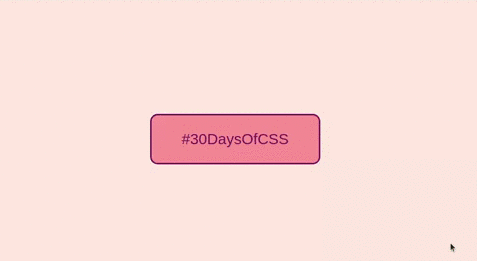

- [My Code](https://github.com/RaquelLima7/30DaysOfCSS/tree/main/Challenges/Day_25)
- [Post LinkedIn](https://www.linkedin.com/posts/raquellima7_30daysofcss-30diasdecss-frontend-activity-6803645822761259008-Z1Mh) 

 
  
 ## Day 26 - Animated circles 
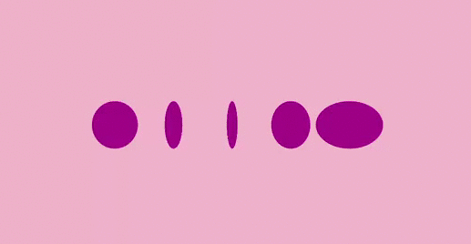

- [My Code](https://github.com/RaquelLima7/30DaysOfCSS/tree/main/Challenges/Day_26)
- [Post LinkedIn](https://www.linkedin.com/posts/raquellima7_30daysofcss-30diasdecss-frontend-activity-6804026950273830912-mlP4) 

 
  
## Day 27 - Circles with effects 
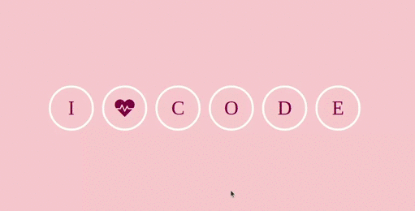

- [My Code](https://github.com/RaquelLima7/30DaysOfCSS/tree/main/Challenges/Day_27)
- [Post LinkedIn](https://www.linkedin.com/posts/raquellima7_30daysofcss-30diasdecss-frontend-activity-6804386175462240256-ModF) 

 
  

## Day 28 - Page Background Animation 

- [My Code](https://github.com/RaquelLima7/30DaysOfCSS/tree/main/Challenges/Day_28)
- [Post LinkedIn](https://www.linkedin.com/posts/raquellima7_30daysofcss-30diasdecss-frontend-activity-6804862390841212928-dzgu) 

 
  
## Day 29 - Effect with heart 

- [My Code](https://github.com/RaquelLima7/30DaysOfCSS/tree/main/Challenges/Day_29)
- [Post LinkedIn](https://www.linkedin.com/posts/raquellima7_30daysofcss-30diasdecss-frontend-activity-6805099757627871232-mk8h) 

 

## Day 30 - Fireworks 
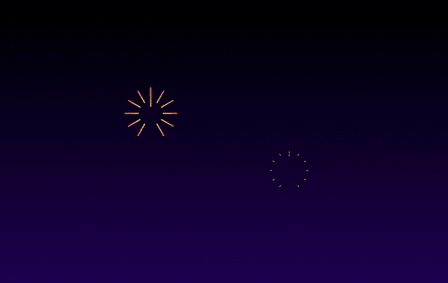

- [My Code](https://github.com/RaquelLima7/30DaysOfCSS/tree/main/Challenges/Day_30)
- [Post LinkedIn](https://www.linkedin.com/posts/raquellima7_30daysofcss-30diasdecss-frontend-activity-6805475043443838976-c5MX) 

 
